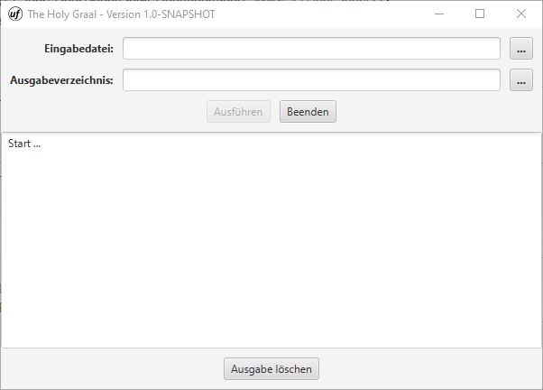

= The Holy Graal (THG) – Bedienungsanleitungen {project-version}
:toc: left
:icons: font

== Übersicht
Das soll mal die Bedienungsanleitung werden bzw. ein Beispiel für die Erstellung einer Dokumentation mit https://asciidoctor.org[AsciiDoc] sein.

Die üblichen Auszeichnungen wie *fett* und _kursiv_ und die Kombination aus *_fett und kursiv_* sind selbstverständlich möglich.

== 1 Einleitung

WARNING: Nur für Experten!

Und hier mal ein Zitat:

[quote, Volksweisheit, aus der Erinnerung niedergeschrieben]
Es gibt nichts Gutes, außer man tut es!

== 2 Installation

Aufzählen gehen natürlich auch:

- erstens,
- zweitens und
- drittens.

Oder mal nummeriert:

1. Anton,
2. Berta und
3. Claudia.

Oder etwas Source Code:

[source,java]
----
public static void main(final String[] args) {
    final int exitCode = new CommandLine(new CommandLineApplication()).execute(args);
    System.exit(exitCode);
}
----

== 3 Verwendung
=== 3.1 Kommandozeile (CLI)
[source,dos]
----
Usage: thg-cli [-hv] [-i=<inputFile>] [-o=<outputDirectory>]

The Holy Graal - Command Line Interface

  -h, --help                Help
  -i, --input=<inputFile>   Input File
  -o, --output=<outputDirectory>
                            Output Directory
  -v, --version             Version

Copyright(c) 2021
----

=== 3.2 Swing GUI
Das ist das *_Swing_* GUI.

=== 3.3 JavaFX GUI
Das ist das *_JavaFX_* GUI.

== 4 Anhang
=== 4.1 Glossar
=== 4.2 Abkürzungsverzeichnis

|===
| Header 1 | Header 2 | Header 3

|Column 1, row 1
|Column 2, row 1
|Column 3, row 1

|Column 1, row 2
|Column 2, row 2
|Column 3, row 2

|Column 1, row 3
|Column 2, row 3
|Column 3, row 3
|===

=== 4.3 Links
